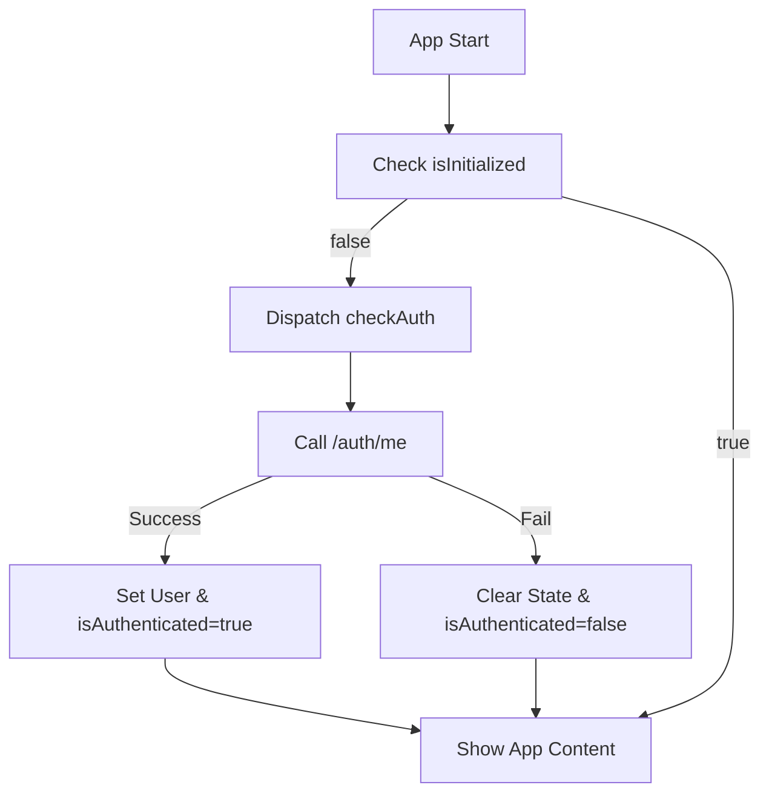

# Authentication System Documentation

## Overview

WoltFlow implements a robust Redux-based authentication system using JWT tokens stored in HttpOnly cookies for maximum security. The system follows industry standards for session management, protected routes, and state persistence.

## Architecture

### Core Components

1. **Redux Store** (`userSlice.ts`) - Centralized authentication state management
2. **Protected Routes** (`ProtectedRoute.tsx`) - Route-level authentication guards
3. **API Interceptor** (`api.ts`) - Automatic token validation and error handling
4. **Loading Screen** (`LoadingScreen.tsx`) - User feedback during authentication checks
5. **Auth Components** (`LoginButton.tsx`, `LogoutButton.tsx`) - Reusable UI components

### Authentication Flow



## State Management

### User Slice Structure

```typescript
interface AuthState {
  user: GoogleUser | null; // User profile data
  isAuthenticated: boolean; // Authentication status
  isLoading: boolean; // Loading state for async operations
  error: string | null; // Error messages
  isInitialized: boolean; // Whether auth check has completed
}
```

### Actions

#### Async Thunks

- `checkAuth()` - Validates session with server on app start
- `logoutUser()` - Performs server-side logout and clears session

#### Synchronous Actions

- `loginSuccess(user)` - Sets user data after successful login
- `logoutSuccess()` - Clears user data after logout
- `clearError()` - Clears error messages
- `setLoading(boolean)` - Sets loading state

## Protected Routes

### Implementation

```typescript
export function ProtectedRoute({ children, redirectTo = "/" }) {
  const { isAuthenticated, isLoading, isInitialized } = useSelector(
    (state: RootState) => state.user
  );

  // Show loading while checking auth
  if (!isInitialized || isLoading) {
    return <LoadingScreen message="Verifying authentication..." />;
  }

  // Redirect if not authenticated
  if (!isAuthenticated) {
    return <Navigate to={redirectTo} replace />;
  }

  return <>{children}</>;
}
```

### Usage

```typescript
<Route
  path="/dashboard"
  element={
    <ProtectedRoute>
      <Dashboard />
    </ProtectedRoute>
  }
/>
```

## Session Management

### Cookie-Based Authentication

- **HttpOnly Cookies**: Prevent XSS attacks by making tokens inaccessible to JavaScript
- **7-Day Expiration**: Automatic session timeout for security
- **Secure/SameSite**: Environment-specific cookie security settings

### Session Validation

The system automatically validates sessions on:

- App initialization
- Protected route access
- API calls to protected endpoints

## API Integration

### Interceptor Configuration

```typescript
// Protected routes that trigger logout on 401
const protectedRoutes = [
  "/auth/me",
  "/setting",
  "/automation",
  "/wolt",
  "/gmail",
];

// Automatic logout on 401 for protected routes only
api.interceptors.response.use(
  (response) => response,
  (error) => {
    if (error.response?.status === 401) {
      const isProtectedRoute = protectedRoutes.some((route) =>
        error.config?.url?.includes(route)
      );

      if (isProtectedRoute) {
        store.dispatch(logoutSuccess());
        if (window.location.pathname !== "/") {
          window.location.href = "/";
        }
      }
    }
    return Promise.reject(error);
  }
);
```

## Components

### LoginButton

Reusable login component with customizable styling:

```typescript
<LoginButton variant="outline" size="lg" className="w-full">
  Sign In with Google
</LoginButton>
```

### LogoutButton

Reusable logout component with Redux integration:

```typescript
<LogoutButton
  variant="destructive"
  redirectTo="/login"
  onLogoutComplete={() => console.log("Logged out!")}
>
  Sign Out
</LogoutButton>
```

## Error Handling

### Error States

1. **Network Errors**: Handled by API interceptor
2. **Authentication Failures**: Automatically clear session and redirect
3. **Server Errors**: Display user-friendly messages

### Graceful Degradation

- Failed logout still clears local state
- Network errors don't break the UI
- Loading states prevent user confusion

## Security Considerations

### Best Practices Implemented

1. **HttpOnly Cookies**: Prevent XSS token theft
2. **Automatic Logout**: Clear sessions on authentication failures
3. **Route Protection**: Block unauthorized access to protected pages
4. **State Persistence**: Maintain auth state across page refreshes
5. **Error Boundaries**: Graceful handling of authentication errors

### CSRF Protection

- SameSite cookie attributes prevent CSRF attacks
- CORS configuration restricts cross-origin requests
- Credentials required for all authenticated requests

## Development vs Production

### Environment Differences

```typescript
// Development
const cookieSettings = "HttpOnly; SameSite=Lax; Path=/";

// Production
const cookieSettings = "HttpOnly; Secure; SameSite=Strict; Path=/";
```

### CORS Configuration

- Development: `http://localhost:5173`
- Production: Dynamic origin based on deployment

## Testing Strategy

### Unit Tests

- Redux actions and reducers
- Component authentication states
- API interceptor behavior

### Integration Tests

- Login/logout flows
- Protected route access
- Session persistence

### E2E Tests

- Complete authentication workflows
- Cross-browser compatibility
- Mobile responsiveness

## Troubleshooting

### Common Issues

1. **Infinite Redirects**: Check protected route configuration
2. **Session Not Persisting**: Verify cookie settings and domain
3. **API 401 Loops**: Ensure interceptor logic is correct
4. **Loading Screen Stuck**: Check initialization state management

### Debug Tools

```typescript
// Redux DevTools for state inspection
// Network tab for cookie/session debugging
// Console logs for authentication flow tracking
```

## Migration Guide

### From Old System

1. Replace `googleUserSlice` imports with `userSlice`
2. Update component state selectors: `state.googleUser` → `state.user`
3. Replace manual auth checks with `ProtectedRoute` wrapper
4. Use Redux actions instead of direct API calls

### Breaking Changes

- `clearUser()` → `logoutSuccess()`
- `setUser()` → `loginSuccess()`
- State structure changes require selector updates

## Performance Optimizations

### Lazy Loading

- Auth checks only run once on app start
- Protected routes show loading instead of redirecting immediately
- Components only re-render when auth state changes

### Caching Strategy

- Session validation cached until expiration
- User data persisted in Redux store
- Minimal API calls for auth checks

## Monitoring & Analytics

### Metrics to Track

- Authentication success/failure rates
- Session duration and timeout frequency
- Protected route access patterns
- Error rates and types

### Logging

```typescript
// Structured logging for auth events
console.log("Auth Event:", {
  action: "login_success",
  userId: user.id,
  timestamp: Date.now(),
});
```

## Future Enhancements

### Planned Features

1. **Biometric Authentication**: Fingerprint/Face ID support
2. **Multi-Factor Authentication**: SMS/Email OTP
3. **Session Management**: Multiple device support
4. **Refresh Token Rotation**: Enhanced security
5. **Role-Based Access**: Granular permissions

### Architecture Improvements

- WebSocket for real-time session updates
- Service Worker for offline authentication
- Token refresh background jobs
- Advanced error recovery mechanisms
