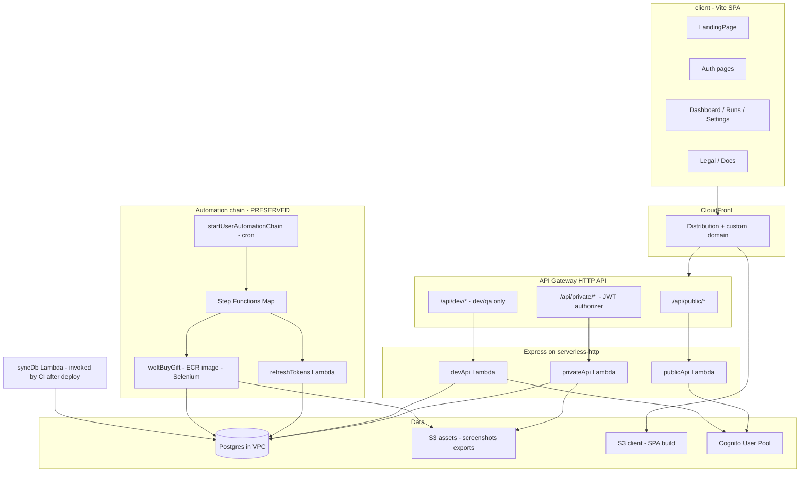

# WoltFlow → Elytra (passwordprotector flavor) migration

## 0. What's already true today (verified state)

Before adding anything, here's what the current `dev` branch already gives us — so the plan can ride on it instead of re-deriving it:

- **Root tooling** (uncommitted in working tree, all in the pending Husky+Prettier commit): root `package.json`, `prettier.config.js`, `.prettierignore`, `.husky/pre-commit` (formats then per-folder build + `eslint --max-warnings 0`), `.vscode/settings.json`.
- **Updated `Server/eslint.config.js`** (also in that commit): project-aware parsing, `eqeqeq`, `no-debugger`, `no-unused-vars` with `_` ignore, single quotes.
- **Security overrides** in `Server/package.json`: `fast-uri >=3.1.2`, `fast-xml-builder >=1.2.0`, `velocityjs >=2.1.6`. `npm audit` is down to 2 low (documented in README).
- **Documented accepted advisory**: `aws-sdk` v2 via `serverless-ecr-image-cleaner` (dev-only, region env-controlled).

When `server-new/package.json` is written, **the three override pins have to be re-applied** — they live in `Server/package.json` overrides, and rewriting that file will lose them.

## 1. What WoltFlow does today (preservation contract)

A serverless full-stack app that automates daily Wolt-Israel "Wolt Benefits" gift-card redemption. Today's stack: AWS Serverless Framework, **Postgres + Sequelize** in a private VPC, **Cognito**, **Selenium-on-Lambda** (Docker image) for the actual purchase, and a **React 19 + Vite 7 + shadcn/ui + Tailwind v4** SPA with **English/Hebrew** i18n and **Redux Toolkit + TanStack Query**.

### Backend surface that must keep working

- **Auth (`/api/auth/*`)** — signup, confirm, login, forgot-password, reset-password, refresh — via Cognito SDK in `Server/src/controllers/auth.ts`.
- **Dashboard (`GET /api/user/dashboard`)** — savings overview + trend chart + last runs.
- **Runs (`GET /api/user/runs`)** — list/filter automation runs.
- **Settings (`/api/user/settings/*`)** — notification (get/put + 2FA start/verify), run (the `automationEnabled` flag is the Step Functions trigger), wolt (creds encrypted via `Server/src/utils/encryption.ts`).
- **Account** — `GET /api/user/export` (ZIP via `archiver`), `DELETE /api/user/delete`.
- **Automation chain** (Step Functions, cron `cron(30 8 ? * SUN,MON,TUE,WED,THU *)`):
  1. `A_startUserAutomationChain` → enumerate users with `automationEnabled`, StartExecution per user.
  2. `B_refreshTokens` → refresh Wolt tokens.
  3. `C_woltBuyGift` → 12-step Selenium flow documented in `Server/src/handlers/automation/automation.md`.
- **Chrome MV3 Extension** (`Extension/`) — out of scope.
- **Python local Selenium runner** (`Script/`) — out of scope (legacy Cibus flow).

### Frontend surface that must keep working

- `react-router-dom` v7 with `/:lng` prefix (`en` / `he`), `LanguageLayout`, `RootRedirect`, `ProtectedRoute`, `GuestRoute`.
- Pages: Landing, Auth (login/signup/verify/forgot/reset), Dashboard, Runs, Settings, Legal (privacy/terms/extension-privacy), Docs, 404.
- Forms: React Hook Form + Zod (`Client/src/lib/validations/settings/`).
- State: Redux Toolkit (`userSlice`), TanStack Query (`queries/*`), consent context.
- Analytics: GA via `VITE_GOOGLE_ANALYTICS_ID`, consent banner.

## 2. Why we're migrating — concrete pain the new stack fixes

Verified against the current code:

| Pain                                                    | Where it bites                                                                                                                                                                                               | Elytra/passwordprotector fix                                                                                                           |
| ------------------------------------------------------- | ------------------------------------------------------------------------------------------------------------------------------------------------------------------------------------------------------------ | -------------------------------------------------------------------------------------------------------------------------------------- |
| **`jwt.decode` without verification** in private routes | `Server/src/middlewares/expressAuth.ts:50` — comment literally says "API Gateway validates the token before it reaches here", which is **false in local dev** (`noAuth: true` in serverless-offline)         | `jwks-rsa` cached + `jwt.verify` with `issuer` and `audience`, used identically in Lambda and local                                    |
| **Open destructive endpoint**                           | `POST /api/auth/sync-database` mounted on the **public** auth router (`Server/src/routes/auth/index.ts:93`) — no auth, runs `sequelize.sync({ alter: true })` + `cleanupObsoleteSchema()` drops on call      | Standalone `syncDb` Lambda invoked from CI (`_deploy.yml`); manual trigger via authenticated `POST /api/dev/sync-db`                   |
| **Two-pass build**                                      | `Server/package.json` `build` = `tsc && webpack`. `tsc` writes to `dist/`, webpack writes to `build/`. Only `build/` is deployed. `dist/` is dead weight on every save. `nodemon.json` reruns the full thing | Single `serverless-esbuild` pass during `deploy`; `build` becomes `tsc --noEmit`; watcher is `serverless-offline-watcher` (no nodemon) |
| **No third Express app**                                | Today there are 2 (auth public, user private); dev tools are bolted onto auth                                                                                                                                | Add `dev-handler` mounted under `/api/dev/*`, gated by `enableDevToolsByStage` (dev/qa: on, prod: off)                                 |
| **Schema drift in-process**                             | `cleanupObsoleteSchema()` SQL in `Server/src/config/bootstrap.ts` runs on every Lambda cold start that calls `syncDatabase()`                                                                                | Schema applied by the `syncDb` Lambda only; bootstrap.ts shrinks to `initDB()`                                                         |
| **Zero tests**                                          | Grepped — no Playwright, pytest, postman, or jest configs in repo                                                                                                                                            | Postman CLI on the backend, Playwright + pytest on the frontend, both wired into `_test-local.yml` and `_test-qa.yml`                  |
| **CI is build-and-deploy only**                         | `Backend-CICD.yml`, `Frontend-CICD.yml` are deploy-on-push; no PR gates                                                                                                                                      | 9-workflow split with reusable `_lint-build`, `_deploy`, `_test-local`, `_test-qa`                                                     |
| **Client 401 redirects bypass `lng`**                   | `Client/src/api/api.ts:53` and `Client/src/utils/authInterceptor.ts:73,79` hard-code `window.location.href = "/auth/login"`; `isOnPublicRoute` checks `/auth/*` not `/:lng/auth/*`                           | Centralized in `client-new/api/instance.ts`, uses current `lng` from path                                                              |
| **Cruft folders**                                       | `Server/undefined/temp` (botched `mkdir`), `Server/templates/{2FA,success,error}` (used by old auth flow), `Server/build/`, `Server/dist/`                                                                   | Not copied into `server-new/`                                                                                                          |

## 3. Preservation contract — these files move untouched

These migrate verbatim, with **only** import-path adjustments where unavoidable:

- `Server/Dockerfile`, `Server/.dockerignore` (Chrome 131.0.6778.204 + chromedriver image).
- `Server/src/handlers/automation/{A_startUserAutomationChain.ts,B_refreshTokens.ts,C_woltBuyGift.ts,automation.md}`.
- `Server/src/utils/{automation.ts,encryption.ts}` (Wolt cred encryption + Selenium helpers — `ENCRYPTION_KEY` env var stays).
- `Server/serverless.yml` Selenium wiring, byte-for-byte:
  - `provider.ecr.images.woltflow-selenium-image`
  - `functions.startUserAutomationChain` (cron, no HTTP)
  - `functions.refreshTokens` (no HTTP)
  - `functions.woltBuyGift` (image-based Lambda, 1536 MB / 1536 MB ephemeral / 300s timeout, command `['build/automation/C_woltBuyGift.handler']`)
  - `stepFunctions.stateMachines.userAutomationChain`
  - `serverless-step-functions` + `serverless-ecr-image-cleaner` plugins
  - IAM statements for `states:StartExecution`, `ecr:*`, `sms-voice:SendTextMessage`, `ses:SendEmail`
- `Extension/` and `Script/` — not touched at all.
- All real `.env.dev|qa|prod` secret values are migrated 1-for-1 to the renamed variables (see §5.7). **No rotation required for the migration itself.**

## 4. Target architecture (post-migration)



### Repo layout (post-cutover)

- `client/` — replaces `Client/` (case-rename at cutover; see §13).
- `server/` — replaces `Server/`.
- `postman/` and `.postman/` — at repo root (passwordprotector Native Git layout).
- `Extension/`, `Script/` — unchanged.
- `package.json` (root) — Husky + Prettier + a `verify` script (`format` + per-folder build/lint), per passwordprotector's CLAUDE.md.
- `temp/` — gitignored, deleted after parity is confirmed.

## 5. Backend (`server/`) — restructure detail

### 5.1 Build & deploy: one esbuild pass

Replace `Server/webpack.config.cjs` + the `tsc && webpack` script + `nodemon.json` with the passwordprotector pattern:

- `server/package.json` scripts:
  - `dev` = `serverless offline --stage dev --param local=true` (esbuild watcher rebuilds on save).
  - `dev:qa` / `dev:prod` analogues.
  - `build` = `tsc --noEmit`.
  - `deploy:dev` / `deploy:qa` / `deploy:prod` = `npm run build && serverless deploy --stage <stage>`. (No separate `build:selenium` step — `serverless-esbuild` handles the image-bound handler as part of the same bundle; the Dockerfile copies `build/automation/C_woltBuyGift.mjs` produced by esbuild.)
  - `lint` = `eslint . --max-warnings 0`.
  - `test:local`, `test:qa` = Postman CLI runs.
- Plugins: `serverless-esbuild`, `serverless-offline`, `serverless-offline-watcher`, `serverless-prune-plugin`, **plus** the preserved `serverless-step-functions` and `serverless-ecr-image-cleaner`.
- `build.esbuild: false` to disable Serverless v4's native bundler.
- esbuild config (copy from passwordprotector lines 176–189): ESM `.mjs`, `target: node22`, `bundle: true`, `minify: true`, `banner` for `createRequire`, `exclude: ['@aws-sdk/*', 'aws-sdk']`, watch `src/**/*.ts`.
- Lambdas point at `src/handlers/.../<name>.handler` directly — the image-based `woltBuyGift` is the one exception (it points at a built path inside the container).

### 5.2 Directory tree under `server/src/`

Mirror passwordprotector exactly:

- `config/` — `environment.ts` (typed accessor), `database.ts` (`initDB`, `syncDB`), `bootstrap.ts`, `providers/sequelize.ts`. **Don't copy the `providers/mongoose.ts` file** — Postgres-only.
- `handlers/api/` — `public-handler.ts`, `private-handler.ts`, `dev-handler.ts`.
- `handlers/scripts/sync-db.ts` — invoked by CI after deploy.
- `handlers/automation/` — preserved files from §3 (A*, B*, C\_, automation.md).
- `routes/`:
  - `public/auth/` → `/signup`, `/confirm`, `/login`, `/forgot-password`, `/reset-password`, `/refresh`.
  - `private/dashboard.ts`, `private/runs.ts`, `private/settings/{notification,run,wolt}.ts`, `private/settings/2fa.ts`, `private/account.ts`, `private/index.ts`.
  - `dev/index.ts` → `sync-db`, `reset`.
- `controllers/` — `auth.ts`, `dashboard.ts`, `runs.ts`, `settings.ts`, `account.ts`, `devtools.ts`. Slim wrappers calling classes/repositories.
- `classes/` — `User.ts`, `Run.ts` (migrated from `Server/src/classes/`).
- `models/`:
  - `definitions/` — interfaces + table names.
  - `sequelize/` — model files + `associations.ts` + repository objects.
  - `index.ts` — `getUserRepository()` etc.
- `middlewares/` — `responseFormatter.ts`, `expressAuth.ts`, `rateLimit.ts`, `errorHandler.ts`, `index.ts`.
- `utils/` — `cognitoUtil.ts`, `s3Util.ts`, `sesUtil.ts` (replaces `emailUtil.ts`), `smsUtil.ts`, `csvUtil.ts`, `exportZipUtil.ts`, `automation/automation.ts`, `automation/encryption.ts` (preserved copies — only `environment` import path changes).
- `types/` — `env.d.ts`, `express-extensions.d.ts`, `api-contracts.ts`, `response.ts`, `index.ts`.
- `email-templates/cognito-verification.html` — adopt the Elytra Cognito email (replaces `Server/templates/{success,error,2FA}/`).

### 5.3 Auth — verify, don't decode

- `expressAuth.ts` follows passwordprotector verbatim: parse Bearer, `verifyToken(token)` from `utils/cognitoUtil.ts` (jwks-rsa cached + `jwt.verify` with `issuer = COGNITO_ISSUER`, `audience = COGNITO_CLIENT_ID`), `userRepo.findByCognitoSub(decoded.sub)`, attach `req.user`.
- API Gateway also keeps the `cognitoAuthorizer` on `privateApi` (defense in depth).
- Local dev: `serverless-offline noAuth: true` bypasses the gateway, **but the Express middleware still verifies the JWT**. This removes the silent-decode loophole that exists today.
- Login still uses `USER_PASSWORD_AUTH`; refresh via `REFRESH_TOKEN_AUTH`. The "first login upserts the app User row" behavior from `Server/src/classes/User.ts#upsertFromLogin` is preserved.

### 5.4 Database — Sequelize + sync-db Lambda

- Sequelize + `pg`, SSL on, `pool { max: 2 }` (passwordprotector pattern — fits Postgres connection-limit budgets when many Lambdas spin up).
- Local: `DATABASE_URL_LOCAL` auto-selected when `IS_OFFLINE === 'true'` (set by `serverless-offline`).
- Deployed: `DATABASE_URL`.
- **The temporary `cleanupObsoleteSchema()` SQL block and `POST /api/auth/sync-database` route are deleted as a pre-migration step (`delete-open-sync-database-route` todo).** Both `Server/src/config/bootstrap.ts` and `Server/src/routes/auth/index.ts` get pruned.
- Schema is applied by `server/src/handlers/scripts/sync-db.ts` Lambda invoked from `_deploy.yml` after every deploy.

### 5.5 URL surface change (frontend has to follow)

| Today                                 | After                                                    |
| ------------------------------------- | -------------------------------------------------------- |
| `POST /api/auth/signup`               | `POST /api/public/auth/signup`                           |
| `POST /api/auth/login`                | `POST /api/public/auth/login`                            |
| `POST /api/auth/refresh`              | `POST /api/public/auth/refresh`                          |
| `GET /api/user/dashboard`             | `GET /api/private/dashboard`                             |
| `GET /api/user/runs`                  | `GET /api/private/runs`                                  |
| `GET /api/user/settings/notification` | `GET /api/private/settings/notification`                 |
| `GET /api/user/export`                | `GET /api/private/account/export`                        |
| `DELETE /api/user/delete`             | `DELETE /api/private/account`                            |
| `POST /api/auth/sync-database`        | **removed**; `POST /api/dev/sync-db` for manual triggers |

### 5.6 Step Functions, Selenium, Docker — preserved

The `stepFunctions:` block, `provider.ecr.images.woltflow-selenium-image`, the three automation `functions:` entries, the cron expression, all timeouts/memory sizes, and the related IAM statements are copy-pasted into `server/serverless.yml`. The Dockerfile path stays `./Dockerfile` (i.e. inside `server/`). **Do not retype any of this — pull it from `Server/serverless.yml` lines covering ECR, stepFunctions, and the three automation functions verbatim.**

### 5.7 Env var rename map (no new secrets)

| Today                                                                                                    | Future                     | Notes                                                                                        |
| -------------------------------------------------------------------------------------------------------- | -------------------------- | -------------------------------------------------------------------------------------------- |
| `DOMAIN_NAME_CLOUD`                                                                                      | `DOMAIN_NAME`              |                                                                                              |
| `DATABASE_URL_CLOUD`                                                                                     | `DATABASE_URL`             |                                                                                              |
| `DATABASE_URL_LOCAL`                                                                                     | `DATABASE_URL_LOCAL`       | unchanged; auto-selected via `IS_OFFLINE`                                                    |
| `IS_LOCAL`                                                                                               | (removed)                  | replaced by `IS_OFFLINE` (set by serverless-offline) + `--param local` for Cognito switching |
| `S3_CLIENT_BUCKET_NAME`                                                                                  | (removed)                  | derived from `DOMAIN_NAME` in `serverless.yml`                                               |
| `S3_EMAIL_BUCKET_NAME`, `EMAIL_SUBDOMAIN`, `STACK_BASE_NAME`, `DEVELOPMENT_DATE`                         | (removed)                  | all legacy / unused                                                                          |
| `ENCRYPTION_KEY`, `ENABLED_SMS`, `S3_ASSETS_BUCKET_NAME`, `LAMBDA_SECURITY_GROUP_ID`, `LAMBDA_SUBNET_ID` | unchanged                  | WoltFlow-specific extras                                                                     |
| `COGNITO_CLIENT_ID`, `COGNITO_USER_POOL_ID`, `COGNITO_ISSUER`                                            | unchanged                  | required for local dev; populate from CFN outputs after first deploy                         |
| `DATABASE_PROVIDER`                                                                                      | new — set to `"sequelize"` | required by the Elytra provider switch, even though we only have one provider                |

`USER_AUTOMATION_STATE_MACHINE_ARN` stays — injected by `serverless.yml` via `Fn::Sub`, not via `.env`.

### 5.8 Backend dependencies

Start from passwordprotector's `server/package.json`, then:

- **Add**: `selenium-webdriver` ^4, `@types/selenium-webdriver`, `archiver` ^7, `@types/archiver`, `@aws-sdk/client-sfn`, `@aws-sdk/client-pinpoint-sms-voice-v2`, `patch-package`.
- **Drop** vs current `Server/package.json`: `webpack`, `webpack-cli`, `ts-loader`, `nodemon`, `concurrently`, `cross-env`. Drop `@googleapis/oauth2` and `google-auth-library` only after a `grep -r "@googleapis\|google-auth"` in `Server/src/` returns nothing — these are listed as deps but I haven't traced their callers; verify before removing.
- **Keep**: `serverless-step-functions` and `serverless-ecr-image-cleaner` devDeps (required for the preserved automation chain).
- **Re-apply** the 3 security overrides from the in-progress Husky/Prettier commit: `fast-uri >=3.1.2`, `fast-xml-builder >=1.2.0`, `velocityjs >=2.1.6`. These will get blown away by starting from passwordprotector's package.json.

## 6. Frontend (`client/`) — restructure detail

### 6.1 Stack & layout

Adopt passwordprotector's `client/` shell (Vite 7, React 19, Tailwind v4, shadcn `new-york`, Radix, Redux Toolkit, TanStack Query, react-router v7, i18next, axios), then layer WoltFlow's domain pages on top.

Tree:

- `client/src/data/app.ts` — single branding source (name "WoltFlow", `baseUrl`, default metadata, favicon paths). Replaces ad-hoc strings scattered across current `Client/`.
- `client/src/api/instance.ts` — single Axios instance, request interceptor adds Bearer idToken, response interceptor refreshes on 401 (skipping `/api/public/auth/*`).
- `client/src/api/services/{authService,userService,dashboardService,runsService,settingsService}.ts` — typed wrappers.
- `client/src/api/queries/` — TanStack Query hooks per domain.
- `client/src/store/` — Redux Toolkit `userSlice` (idToken in sessionStorage, refreshToken in localStorage).
- `client/src/router/` — `index.tsx` with `LanguageLayout` + `AppRouter` + `AuthRouter` + `LegalRouter` + `RootRedirect` + `ProtectedRoute` + `GuestRoute`.
- `client/src/pages/` — `LandingPage`, `auth/{Login,Signup,Verify,ForgotPassword,ResetPassword}.tsx`, `DashboardPage`, `RunsPage`, `SettingsPage`, `legal/{Privacy,TermsOfService,ExtensionPrivacy}.tsx`, docs section, `NotFoundPage`.
- `client/src/components/` — `layouts/`, `forms/`, `pages/{dashboard,runs,settings,landing,docs,consent}/...`, `shared/{...}`, `ui/`.
- `client/src/hooks/`, `client/src/lib/utils.ts`, `client/src/lib/validations/settings/{notification,run,wolt}.ts`.
- `client/src/i18n/` — `config.ts`, `resources.ts`, `locales/{en,he}/...`.
- `client/src/types/` — local types + import shared `@api-types` from `../server/src/types`.
- Tests in `client/tests/` (see §10).

### 6.2 Wiring fixes

- API base changes from `/api/auth|user/*` to `/api/public|private/*` — service files only; no UI churn.
- `isOnPublicRoute` must match `/:lng/auth|legal|docs/*`. Current implementation in `Client/src/utils/authInterceptor.ts:30` only checks `/auth/login` etc. without the language prefix.
- All redirects use `useNavigate(\`/${lng}/auth/login\`)`. The two `window.location.href = '/auth/login'` hard-codes (`api.ts:53`and`authInterceptor.ts:73,79`) become navigations through the current language.
- `vite.config.ts`: alias `@` → `./src`, `@api-types` → `../server/src/types`. Manual `rollupOptions.output.manualChunks` for redux/query/icons/ui/vendor.
- `client/.env.example`: only `VITE_GOOGLE_ANALYTICS_ID` and `VITE_SMS_ENABLED` (the rest in current `Client/.env` aren't read by code — verified). No Cognito Vite vars — the SPA never talks to Cognito directly; the public-auth Lambda does.

### 6.3 Frontend dependencies

Start from passwordprotector's `client/package.json`. Add (from current Client deps): `@hookform/resolvers`, `react-hook-form`, `zod`, `@tanstack/react-table`, `recharts`, `date-fns`, `cmdk`, `vaul`, `embla-carousel-react`, `react-day-picker`, `input-otp`, `next-themes`, `sonner`, `react-resizable-panels`, `jwt-decode`. Take passwordprotector's version when a dep already exists on both sides.

## 7. Cognito IaC

Verbatim from passwordprotector's `resources:` block: `CognitoUserPool` (email username/auto-verify, password policy, `EmailConfiguration: DEVELOPER` + `From: authenticator@${DOMAIN_NAME}` + `SourceArn: <SES identity ARN>`, custom verification HTML at `server/email-templates/cognito-verification.html`), and matching `CognitoUserPoolClient` (`ALLOW_USER_PASSWORD_AUTH | ALLOW_REFRESH_TOKEN_AUTH | ALLOW_USER_SRP_AUTH`, `EnableTokenRevocation: true`, 1h tokens, 30d refresh).

**The Cognito pool name decision is binding** (see `cognito-pool-naming-decision` todo). The plan keeps `appName: woltflow-server` so the pool resource name resolves to `woltflow-server-${stage}` — matching today's `${self:service}-${stage}` and preserving existing user accounts.

`Outputs:` for `CognitoUserPoolId`, `CognitoClientId`, `CognitoIssuer` are the source of truth for `.env` after first deploy. `local: ${param:local, 'false'}` switches CFN refs ↔ env vars between deploy and local dev.

## 8. CI/CD — port passwordprotector's 9 workflows

Copy from `temp/passwordprotector/.github/workflows/`:

- `_lint-build.yml` (reusable): `npm ci` + `npm run lint` + `npm run build` for both `client/` and `server/`.
- `_deploy.yml` (reusable): AWS OIDC role assume, `npm run deploy:<stage>` in `server/`, **invoke `<appName>-<stage>-syncDb`** via `aws lambda invoke`, build client, `aws s3 sync client/dist s3://<S3ClientBucketName>`, CloudFront invalidation (`/index.html` + `/*`).
- `_test-local.yml` (reusable): spin up `serverless offline --param local=true` in background, `npm run test:local` (Postman CLI), then start Vite, run `npm test` in `client/`.
- `_test-qa.yml` (reusable): Postman `test:qa` against deployed QA URL, Playwright `test:qa` against `https://${secrets.DOMAIN_NAME}`.
- `pr-qa.yml`, `pr-main.yml`, `push-dev.yml`, `push-qa.yml`, `push-main.yml` — orchestrators.

**Order matters in `_deploy.yml`**: `serverless deploy` has to land before `aws lambda invoke syncDb` (the Lambda doesn't exist until then). On a fresh stack, the first deploy creates the pool — after that finishes, `.env` needs the Cognito outputs before `test:qa` can run. Document this in the workflow comments.

Preserve `Extension-CICD.yml` untouched. Delete `Backend-CICD.yml`, `Frontend-CICD.yml`.

GitHub Environments (`dev`, `qa`, `prod`) get the renamed secrets per §5.7.

## 9. Code quality (Husky + Prettier + ESLint) — already in flight

Most of this is already in the uncommitted root-tooling commit (`husky-prettier-baseline` todo). What still needs doing:

- Once `client/` and `server/` exist, drop the new flat-config `eslint.config.js` files into each (taken from passwordprotector).
- Add `.cursor/rules/` entries from passwordprotector if not present: `node-express.mdc`, `react.mdc`, `tailwind.mdc`, `typescript.mdc`, `database.mdc`. Keep the existing `clean-code.mdc`, `codequality.mdc`, `gitflow.mdc`.
- Root `package.json` gets a `verify` script: `npm run format && (cd client && npm run lint && npm run build) && (cd server && npm run lint && npm run build)`. passwordprotector's CLAUDE.md explicitly recommends this as the single pre-PR command.
- Update root `.gitignore` to add `.serverless/`, `.esbuild/`, `client/dist/`, `server/dist/` and drop the `Server/build/`/`Client/dist` lines that match the old layout. (Most of this is also in the in-flight tooling commit.)

## 10. Tests — built fresh as part of migration

There are zero tests today (verified). Tests are part of the migration so CI is green on day one.

### Backend — Postman

- Layout under `postman/`: collections in `WoltFlow API/...` (Native Git V3, matching passwordprotector), environments `WoltFlow Local.environment.yaml` and `WoltFlow QA.environment.yaml`, globals.
- `.postman/resources.yaml` wires them to the Postman workspace.
- Coverage (smoke + happy + error per endpoint): `Public/Auth`, `Private/Dashboard`, `Private/Runs`, `Private/Settings/{Notification,Run,Wolt,2FA}`, `Private/Account/{export,delete}`, `Dev/Sync-DB`, `Dev/Reset` (last two local/QA only).
- `server/package.json` `test:local` / `test:qa` invoke the Postman CLI.

### Frontend — Python pytest + Playwright

- `client/tests/`: `pytest.ini`, `conftest.py`, `requirements-test.txt`, `viewports.py`, `config.py`, `scripts/run-tests.ts`, `scripts/export-translations.ts`, `e2e/{landing,auth_login,auth_signup,auth_confirm_signup,auth_forgot_password,auth_reset_password,dashboard,runs,settings,legal_privacy,legal_terms,page_404}/{smoke,responsive,visual,accessibility,security}.py`, `e2e/flows/critical.py`, `helpers/{mailtm,responsive,screenshot_on_failure,translation_utils}.py`.
- `client/package.json`: `test`, `test:qa`, `test:install` scripts wired to the Elytra runner.
- `pytest.ini` markers: `smoke`, `visual`, `responsive`, `accessibility`, `security`.

## 11. Local dev workflow (parity with today)

- `cd server && npm install && npm run dev` → Serverless Offline on port 3000 with esbuild watcher.
- `cd client && npm install && npm run dev` → Vite on port 5173.
- SPA hits `http://localhost:3000/api/public/*` and `/api/private/*` (modulo the §5.5 URL rename).
- Local Postgres via `DATABASE_URL_LOCAL` (bastion-tunneled — same value as today). Bastion access is owner-only.
- Step Functions + Selenium are **not run locally** (never were). Ad-hoc test:
  ```bash
  serverless invoke local -f startUserAutomationChain --data '{"userId":"<id-or-cognito-sub>"}'
  ```

## 12. Critical gotchas (read before starting)

These came out of cross-checking the plan against the current code:

1. **`POST /api/auth/sync-database` is OPEN and DESTRUCTIVE.** It's on the public auth router (no JWT). Anyone who knows the URL can drop tables. **Delete it before doing anything else** — it has its own todo at the top of the list.
2. **Cognito pool name is load-bearing.** Today: `${self:service}-${stage}` = `woltflow-server-dev`. passwordprotector uses `${self:custom.appName}-${stage}`. Pick `appName: woltflow-server` to keep the same name and the same pool. Picking `woltflow` would create a new pool and force every user to re-onboard. Decide this before the first new-stack deploy.
3. **The 3 npm-audit overrides have to be re-applied** when writing `server/package.json` — they live in `Server/package.json` overrides today and the rewrite will drop them. Audit needs to stay clean.
4. **Don't retype the Step Functions / Selenium serverless config.** Copy it byte-for-byte from `Server/serverless.yml`. Re-deriving anything in that block is how outages happen.
5. **`build:selenium` is gone.** Today there's a manual `esbuild` invocation that bundles `C_woltBuyGift.ts` into `build/automation/`. Under the new layout, `serverless-esbuild` handles it. The Dockerfile already `COPY build/`s — make sure `serverless-esbuild` writes there in time for `docker build`, or change the Dockerfile to `COPY .esbuild/.build/`. **Verify before first deploy that the image actually contains the bundle.** This is the single highest-risk integration in the migration.
6. **`Server/undefined/temp` exists.** It's a directory, likely created by `mkdir undefined` in a botched script. Don't carry it over.
7. **Windows case-only rename of `Server/` → `server/`** is unreliable on `core.ignoreCase = true`. Use a two-step rename through a temporary name (`git mv Server server_tmp && git mv server_tmp server`). Document this in the cutover PR description so reviewers don't get confused by two renames in `git log`.
8. **Auth verification gap is silent in local dev today.** `serverless-offline noAuth: true` bypasses the gateway authorizer, and `expressAuth` only calls `jwt.decode` — so any non-empty Bearer string with a valid `sub` would pass locally if a matching `User` row exists. New stack closes this. Beware of any code that depended on the gap.
9. **`DATABASE_PROVIDER=sequelize` is required** even though we drop the mongoose code — the Elytra provider switch reads it.
10. **First deploy chicken-and-egg.** `_deploy.yml` invokes `syncDb` after `serverless deploy`. On a brand-new stack the Lambda doesn't exist until that deploy completes, so the invoke step has to follow it. Similarly `_test-qa.yml` needs Cognito outputs in env — populate them from CFN outputs _after_ the deploy step before the test step runs.

## 13. Phasing — when "green" is honest

Each phase ends with `npm run verify` (root) green plus the listed smoke check. Build can stall safely at the end of any phase.

| Phase                         | Goal                                                                                                           | "Green" definition                                                                                                                                                   |
| ----------------------------- | -------------------------------------------------------------------------------------------------------------- | -------------------------------------------------------------------------------------------------------------------------------------------------------------------- |
| **0. Pre-migration cleanup**  | Land Husky+Prettier+lint commit; delete the open `sync-database` route; ensure HEAD `Server` builds            | Current Server still builds and deploys; pre-commit hook works                                                                                                       |
| **1. Scaffold `server-new/`** | New tree + Cognito IaC + sync-db Lambda, **no domain routes yet**                                              | `cd server-new && npm run build` passes; `serverless deploy --stage dev` succeeds against a throwaway pool name; `aws lambda invoke ... -syncDb` returns OK          |
| **2. Auth on `server-new/`**  | Public auth handler + private handler skeleton wired; one private dashboard route returning a stub             | Postman `Public/Auth` collection green against `serverless offline`                                                                                                  |
| **3. Preserve automation**    | Copy A*/B*/C\_ + utils/automation + Dockerfile; wire ECR image and Step Functions block; smoke-invoke locally  | `serverless invoke local -f startUserAutomationChain --data '{"userId":"<test>"}'` returns success; `serverless package` produces the woltflow-selenium-image bundle |
| **4. Domain routes**          | Dashboard, runs, settings, account routes ported; encryption + S3 export still work                            | Full Postman collection green                                                                                                                                        |
| **5. Scaffold `client-new/`** | New Vite tree + branding + router + Redux + Axios + i18n; landing page + auth pages                            | `npm run dev` serves landing + auth; manual signup/login round-trips through `server-new`                                                                            |
| **6. Client domain pages**    | Dashboard, Runs, Settings, Account ported                                                                      | Critical-flow Playwright suite green locally                                                                                                                         |
| **7. Tests + CI**             | Full Postman + Playwright/pytest suites; 9 workflows in place; PR gates active                                 | `_test-local.yml` and `_test-qa.yml` both pass in a draft PR                                                                                                         |
| **8. Cutover PR**             | Delete `Server/` + `Client/`; rename `server-new` → `server`, `client-new` → `client`; deploy `dev` end-to-end | Real cron-triggered automation run in `dev` completes with a screenshot in S3 and a row in `Runs`                                                                    |

## 14. Out of scope (explicit)

- `Extension/` (Chrome MV3 token reviewer) — untouched.
- `Script/` (Python local Selenium runner for the deprecated Cibus flow) — untouched.
- DB data migration — schema is applied by `sync-db` Lambda; table set stays the same, existing rows carry over.
- Cognito user data migration — pool name is preserved (see §12 gotcha 2), so accounts are untouched.
- `temp/` (`elytra/` + `passwordprotector/` reference clones) — kept gitignored during migration, deleted at the end after parity.
- Secret rotation — values are re-keyed under new names, but not rotated.
